<h1 align="center">📑 Documentation & Project Convention </h1>

## Team Convention

- Dùng Docker để chạy các service - giúp dễ dàng trong hỗ trợ fix bug.
- Recommend dùng VSCode là code editor để đồng nhất format code. Nên cài các extensions sau:
  - [Prettier - code formatter](https://marketplace.visualstudio.com/items?itemName=esbenp.prettier-vscode)
  - [GraphQL for VSCode](https://marketplace.visualstudio.com/items?itemName=kumar-harsh.graphql-for-vscode)
  - [EditorConfig](https://marketplace.visualstudio.com/items?itemName=EditorConfig.EditorConfig)
  - [TODO Tree - Note TODO, BUG comments](https://marketplace.visualstudio.com/items?itemName=Gruntfuggly.todo-tree)
  - [Auto Import](https://marketplace.visualstudio.com/items?itemName=steoates.autoimport)
  - [Code Spell Checker](https://marketplace.visualstudio.com/items?itemName=streetsidesoftware.code-spell-checker)
- Cập nhật trạng thái task trên Notion trước và trong khi làm task.
- Git convention:

  - Dùng `yarn commit` để commit theo chuẩn để dễ trace history

    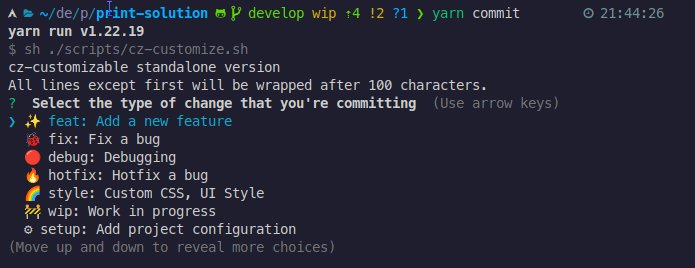

  - Thứ tự khi làm 1 feature mới:
    - Từ `develop`, pull code mới nhất về
    - Tách branch mới với prefix `feature/<name>` (hoặc các prefix khác như /setup, hotfix/ ...)
    - Sau khi code xong, pull `develop` và **xử lý conflict** nếu có.
    - Tạo `Pull Request`, assign & notify teams review
    - Merge develop & xóa branch nếu không dùng nữa.

- Coding convention:

  - Hạn chế tối đa `Hard code`, nên bỏ vào constants để sử dụng.
  - Với các service BE dùng `logger` thay cho `console.log` để trace log **(Bắt Buộc)**

  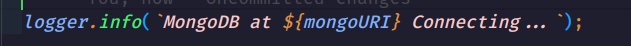

  - Các hàm tái sử dụng nên được viết ra utils, trước khi viết hàm (component) nên xem đã có ai viết trước đó hay chưa.
  - Các Promise nên dùng `to()` function trong [await-to-js](https://www.npmjs.com/package/await-to-js) để giảm try-catch

  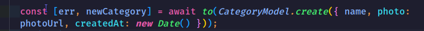

## Get Started

- Cách chạy service xem file [README.md](../README.md) bên ngoài.
- Sau khi chạy xong, kiểm tra lại services đã chạy hết hay chưa (trừ service `mongo-import`):

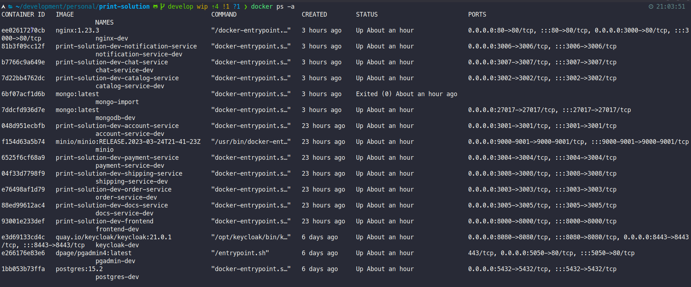

- Kiểm tra qua trình duyệt:

  - Frontend: [http://localhost:8000](http://localhost:8000)
  - Với REST service: `http://localhost:3000/api/<service-name>/check-health`

    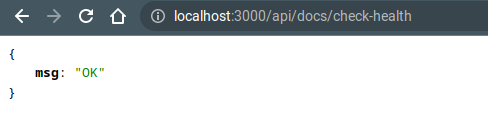

  - Với GraphQL service: `http://localhost:3000/api/<service-name>` sẽ thấy màn hình Apollo sandbox

    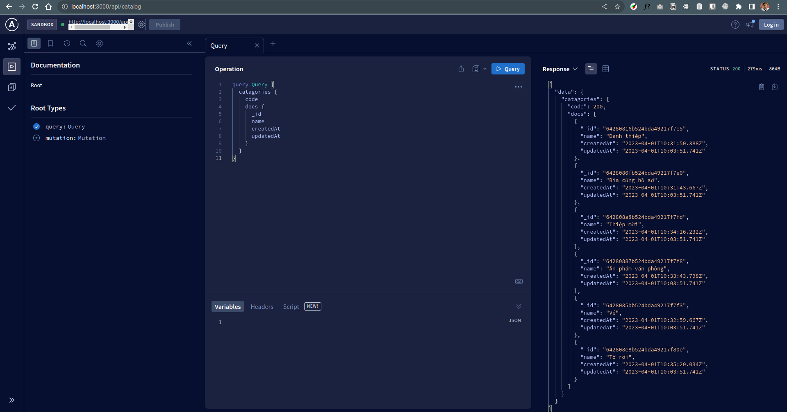

  - Keycloak admin [http://localhost:8080](http://localhost:8080/admin/master/console/#/print-solution-realm)

    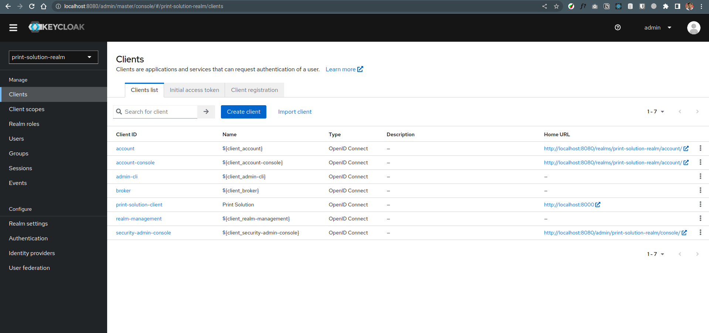

  - Minio console [http://localhost:9001/browser](http://localhost:9001/browser)

    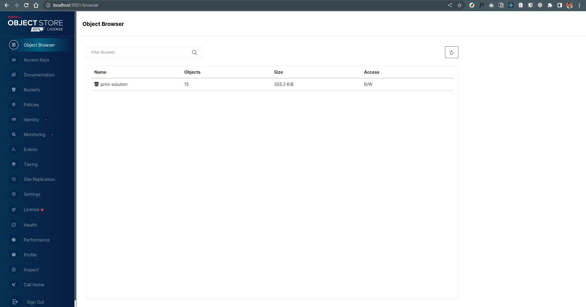

  - PgAdmin [http://localhost:5050](http://localhost:5050/)

    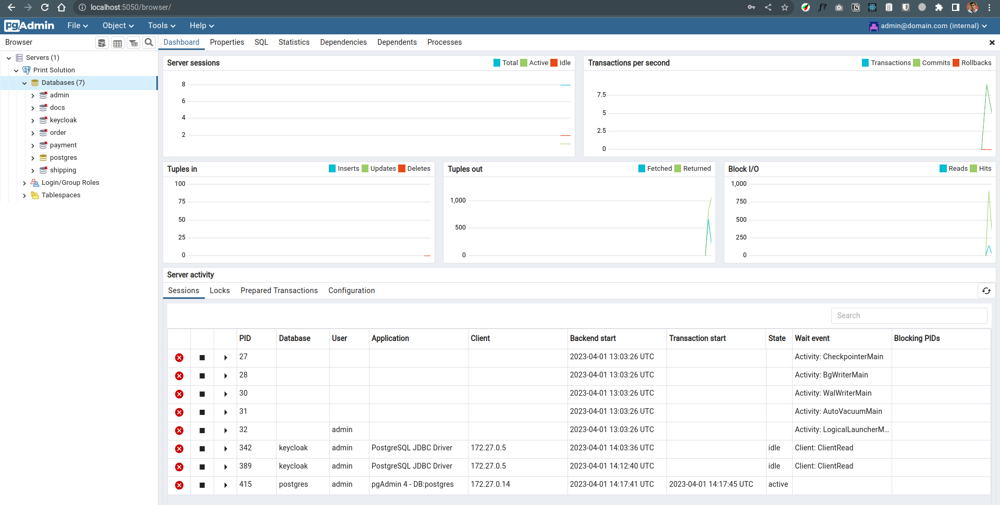

## Frontend

- Hình ảnh, static file sử dụng qua `Minio`, không bỏ vào thư mục frontend. Sử dụng thông qua hàm `withStatic`

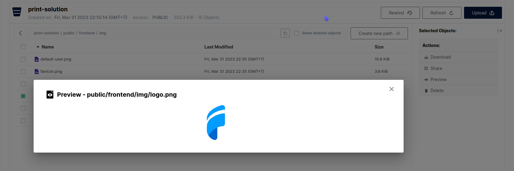
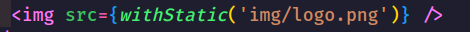

- UI Library dùng [Material UI](https://mui.com/) & **@cads-ui/core** (thư viện này tui build dựa trên MUI). **Không nên** dùng thêm các thư viện UI khác tránh conflict về theme.

- **Authentication / Authorization** thông qua keycloak, sử dụng thông qua các function sau:

  - `useKeycloakInit` khởi tạo keycloak instance, đặt trong các Guard component, chỉ load 1 lần trong mỗi Guard, layout. hook này bắt buộc phải được chạy trước khi dùng các func bên dưới

  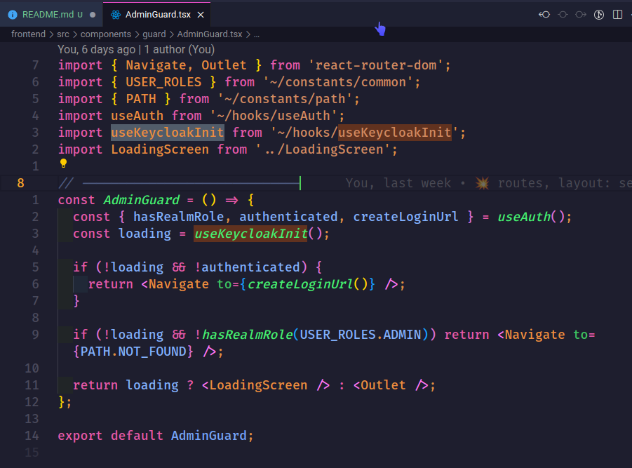

  - `useAuth` lấy keycloak instance (userInfo sau đăng nhập) qua hook này, hoặc sử dụng trực tiếp biến `keycloak` (không khuyến khích).

  

- Routes / Roles: có 3 role chính (guest/customer/admin). Mỗi role có route vào layout riêng biệt.

- Connect với REST service qua Axios

  - Các instance đã config sẵn, dùng thông qua các instance này

  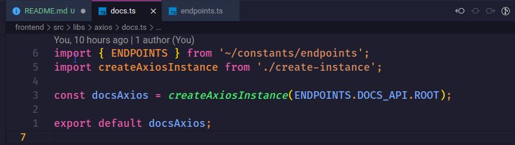

  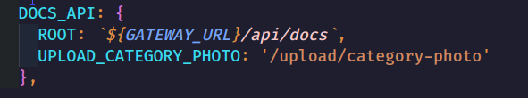

  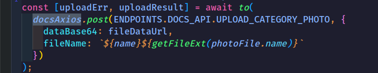

- Connect với GraphQL qua Apollo

  1. Trong folder `graphql` tạo 1 query, mutation trong các file `.graphql` trong folder tương ứng với loại đó. (Nên test trước qua Apollo sandbox rồi copy qua cho nhanh). Có thể viết nhiều query, mutation cùng `resolver` trong cùng 1 file nhé

  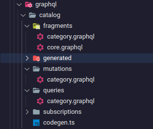

  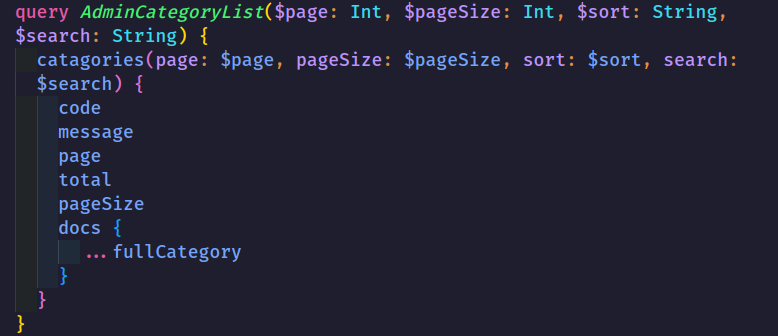

  2. Chạy câu command sau để tự generated ra các hook tương ứng với query trên. Đều này sẽ override file `graphql.tsx` trong cùng folder service đó.

  ```sh
    cd frontend
    yarn graphql-codegen-<service-name>
    # ex: yarn graphql-codegen-catalog
    # ex (watching các file .graphql): yarn graphql-codegen-catalog --watch
    # ex chạy tất cả các serivce qua: yarn graphql-codegen
  ```

  3. Vì Apollo Client chỉ nhận 1 provider gần nhất, nên khi sử dụng service graphql nào thì cần bọc ApolloProvider trên component đó. Nếu trong 1 component có sử dụng nhiều hơn 1 service graphql thì cần tách component đó ra. Có 2 cách dùng Provider, 1 là bao bởi component `<InstanceApolloProvider />` hoặc dùng HOC `withInstanceApolloProvider`

  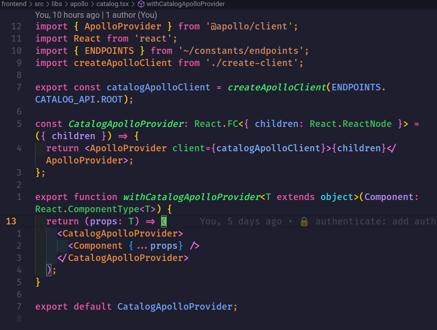

  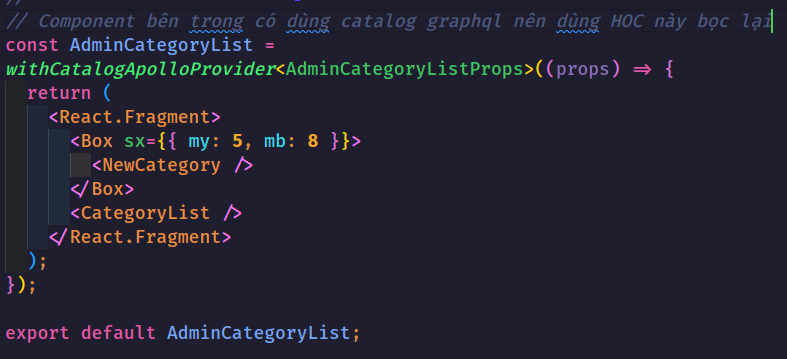

  4. Dùng các hook đã được generate ở bước trên.

  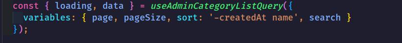

  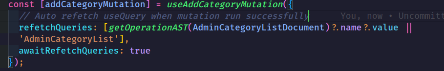

## REST Services

1. Tạo route cho 1 nhóm endpoint api trong `index.js`

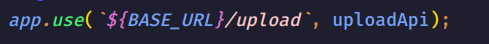

2. Tạo 1 file trong `controllers` để handle các endpoint API trên

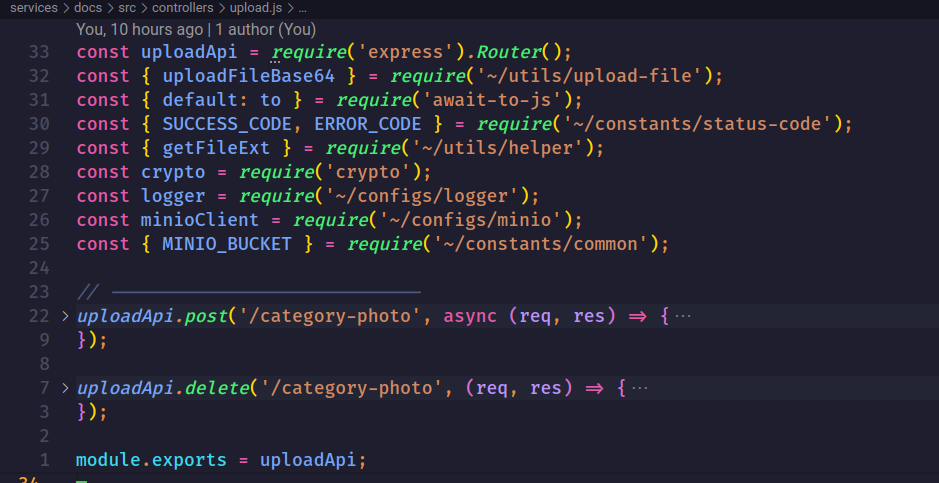

3. Các API nào cần author để thực hiện thì dùng middleware `authenticate` chặn giữa root endpoint ở index.js hoặc mỗi endpoint cần chặn trong controllers. Sau khi dùng, nếu pass middleware này sẽ nhận được thông tin user của keycloak qua `req.user`.

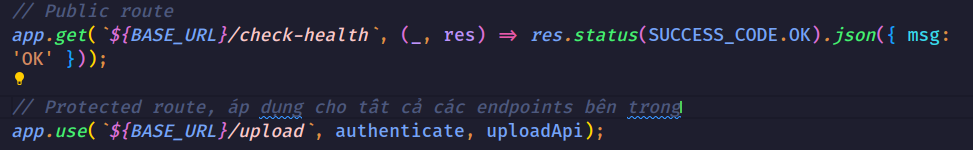

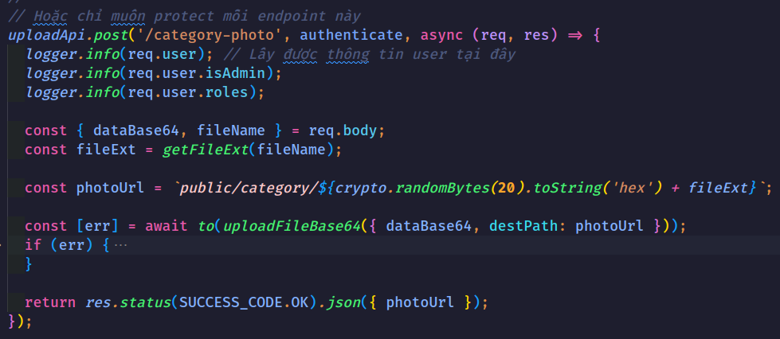

## GraphQL Services

- Sử dụng thư viện [type-graphql](https://typegraphql.com/) để connect với Apollo server & typescript
- Tham khảo code trong category resolver.ts

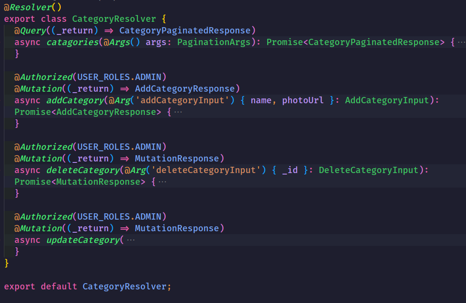

- Author sử dụng Decorators `@Authorized()`, ví dụ `@Authorized(USER_ROLES.ADMIN, USER_ROLES.CUSTOMER)` chỉ cho phép customer và admin thực thi. Nếu để trống thì chỉ cần có token với bất cứ role gì cùng có thể thực thi.
